# Localization

If you add new text into the game via mods, whether that be into a data table, a widget (a game or a mod one), registering mod options etc, then you can support players in all languages by doing a few simple steps to allow the community to localize your mod.

The mod localization architecture is as follows:

1. Each mod adds in their own strings in English
2. There is one mod per language which adds localization for ALL mods and unlocalized strings for the base game

Eventually there may be loads of mods that do stuff, but there will only ever be one mod per language that provides all modded localizations. 

The upsides are that there should only be one mod per language and that the community can easily provide translation entries to the files without each individual mods needing to update themselves to add localizations for every language it receives them for. The downside is maintainers of the localization mods may need to update regularly to support each new mod strings. However this downside can be lessened by localization mods having several contributors on the workshop to spread out the load, as updates is just changing a text file. 

This guide documents:

1. How to make a language's localization mod, using the Simplified Chinese localization mod as an example
2. How to add support for localization in your mod, depending on how the mod adds localization strings:
    - Adding/modifying rows on game data tables which have user facing text
    - Registering mod options, where option name and description can be localized
    - Adding mod widgets to the game with text on

I have provided all example mod source code covered in this guide to the project.

## How to make a language localization mod

Language localization mods are very simple. They work like this:

1. Read a text file from the mod's folder
2. Omitting the header line, parse the comma seperated values into localization keys and translation
3. Add the key and values to that language's localization table in-game (more explanations in the adding localization support in your mod section below)

The localization mods can:
- Add localizations for mods
- Add community localizations for strings in the game that have not been given official translation for yet
- Replace existing official localizations in the game with their own (if for example an official translation is done poorly)

> [!NOTE]
> Strings that have no official translation in the game yet are first added in the data table `Loc_Dev` with an English value. When they get an official translation for each language, they are moved into the `Loc_En` and each language table the translation has been made in.

## Example

Take Simplified Chinese localization mod as an example. We have two files, `zh.txt` and `dev.txt`:

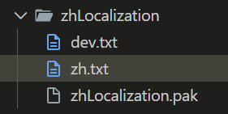

Inside of the `zh.txt` file we have the following example strings:

```
[[This file is for unlocalized strings added by mods or to replace existing localized strings in the base game which can be found in the Loc_Zh table,此文件可以存放来自mod的未本地化的字符串，也可以替换游戏本体中已经本地化过的字符串。这些字符串可以在Loc_Zh 表中找到]]
moredecoratives.slotdecorative.bookshelf,书架
widgetlocalization.demotext,你好这是demotext
toolbar.paths,道路
setting.CameraTweaks-BasePanSpeed.name,基础平移速度
setting.CameraTweaks-BasePanSpeed.description,相机平移的基础速度
```

- The first line in `[[]]` is the header line and will not get parsed into the localization map. It provides instructions for the mod developer/users how to edit the file
- `moredecoratives.slotdecorative.bookshelf,书架` adds the translation `书架` to the bookshelf slot decorative from the More Decoratives mod
- `widgetlocalization.demotext,你好这是demotext` adds the translation `你好这是demotext` to the `widgetlocalization.demotext` localization key (which will be covered in the adding mod widgets section below)
- `toolbar.paths,道路` replaces the existing official translation of `toolbar.paths` to `路径` (this isn't in the released mod, it's just an example)
- `setting.CameraTweaks-BasePanSpeed.name,基础平移速度` adds the translation `基础平移速度` to the Camera Tweaks mod option name for the base pan speed
- `setting.CameraTweaks-BasePanSpeed.description,相机平移的基础速度` adds the translation `相机平移的基础速度` to the Camera Tweaks mod option description for the base pan speed

Inside of the `dev.txt` file we have this example:

```
[[This file is for unlocalized strings in the base game (not added by mods) which can be found in the Loc_Dev table,此文件用于存放游戏本体中未本地化的字符串（不包括mod添加的）。这些字符串可以在 Loc_Dev 表中找到。]]
slotdecorative.crates,箱子
```

- The first line in `[[]]` is the header line and will not get parsed into the localization map. It provides instructions for the mod developer/users how to edit the file
- `slotdecorative.crates,箱子` adds a translation to the crates path decoration which exists in the base game but (at the time of writing) has no official translation yet

> [!NOTE]
> When a string with a community translation gets an official translation and it is moved out of the `Loc_Dev` table, the community translation will still override the official translation because the `Loc_Dev` table gets priority over the other language tables. If the localization mod no longer whishes to override the official translation, they may remove those entries in the `dev.txt` file.

## Coding the mod

> [!IMPORTANT]
> **Check if a localization mod exists for your language first!** If it does, please collaborate with the mod author to add new mod strings to the text files. If the mod author has gone AWOL, please check with the Whiskerwood developers on what they think the best course of action should be.

To internally name your localization mod, please refer to the below list of valid language ID's for your language (the first bit) and name your mod `<lang Id>Localization` e.g. for Simplified Chinese (简体中文) the language ID is `zh` so the internal mod name is `zhLocalization`. Obviously this isn't going to be the actual public facing name of your mod, that should be in your language. But `.pak` files will not be loaded if they have non-ASCII characters in, so it's best off to stick to this naming convention if possible.

```
en - English
fr - Français
de - Deutsch
it - Italiano
es - Español
ru - Русский
ja - 日本語
zh - 简体中文
ko - 한국어
tr - Türkçe
pt - Português Brasileiro
pl - Polski
ua - Українська
cs - Czech
hu - Hungarian
zh-tw - 繁體中文
es-mx - Español de América
```

> [!NOTE]
> You can get an up to date list of these language IDs by calling the `List Language Ids` function on the mod API.

In the localization mod, we simply do the steps once in the main menu in `BP_Startup`.

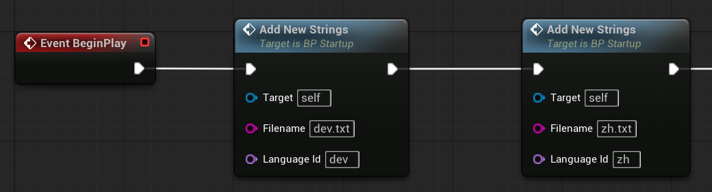

> [!IMPORTANT]
> Due to some bugs in the mod API, you **must** first add the strings to dev first, then to your language Id.

Again the code is available in the project but here it all is. Feel free to copy my implementation of `Add New Strings` for your localization mod too (you can copy the whole function).

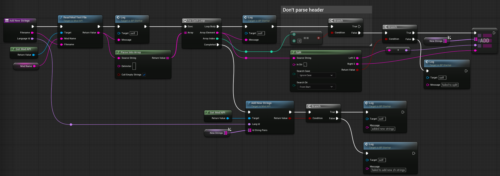

All you need to do is populate the `Mod Name` variable with the localization mod (internal) name, e.g. `zhLocalization`.

You can also enable debug logging for the mod by checking `Log Messages?`, **but make sure you set it to false before you ship your mod**!

## Adding localization support in your mod

### Adding/modifying rows on game data tables

The example mod I will use here is my `More Decoratives` mod which adds new path decorations to the game. This mod involves adding some information to the `SlotDecoratives` data table and to the `Icons_Buildings` data table.

If we go to the `SlotDecoratives` data table, you will notice the column `LocKey`. This is short for localization key, and it stores the reference key to the localization tables for whatever language you have selected. 

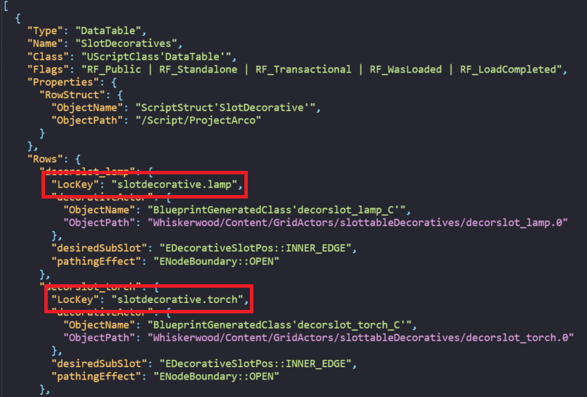

If you see a column called this, or called similar to this in any other data tables, then you know it will be the same. So `SeasonDefs` has `Label`, `ProblemIndicatorMessages` has `detailString`, `GridactorDefs_Sync` has `stringKey` etc.

If you look in one of the localization tables (which are found in `Content/Data/TextDB`), you can search for these keys.

*In Loc_En (English strings)*

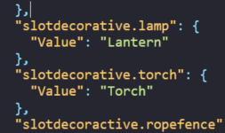

*In Loc_Zh (Simplified Chinese strings)*

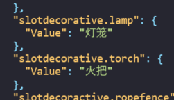

In your mod, you should add your own *unique* key to the data table. If it is not unique, then the game might pick up a string that is not your string. You should also make them unique to your mod, in case another mod adds a key of the same name. 

For example, in `More Decoratives` mod, I am using the key `moredecoratives.slotdecorative.<item added>`. It follows the standard set by the game slotdecoratives and keeps it unique to my mod name. 

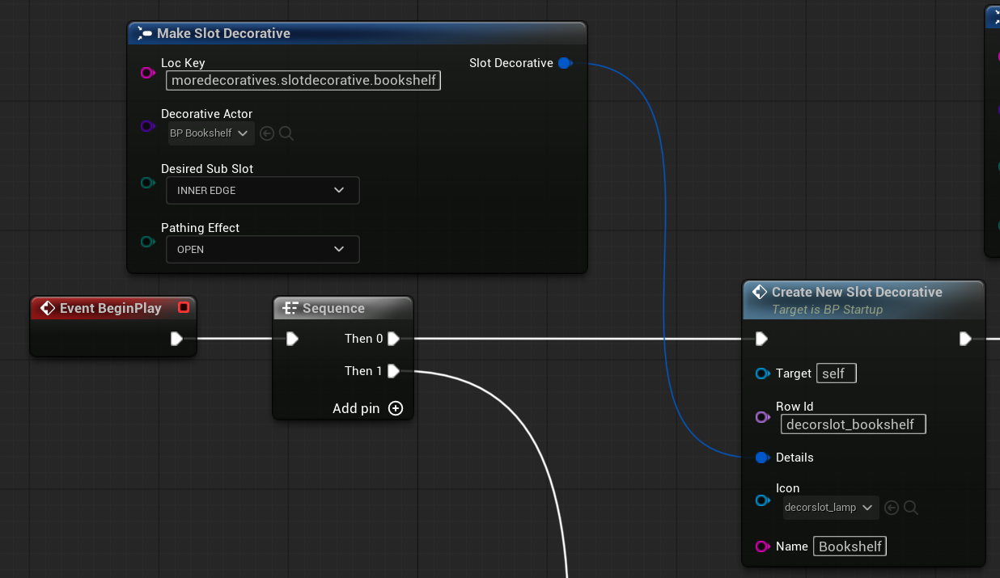

So here I am adding my key to the `LocKey` column. If for some reason you didn't want your mod to be localizable and only be in your specific language, you could just add the hardcoded string to that column and when the game goes to look up that string in the localization tables and doesn't find it, it falls back to just showing the `LocKey` value in-game. We'll see this more later.

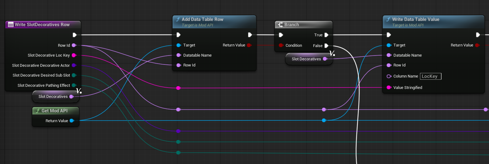

Now, the last thing I do when I add each new slot decorative is I add the `LocKey` and the actual English name to a map I have called `Loc Strings`.

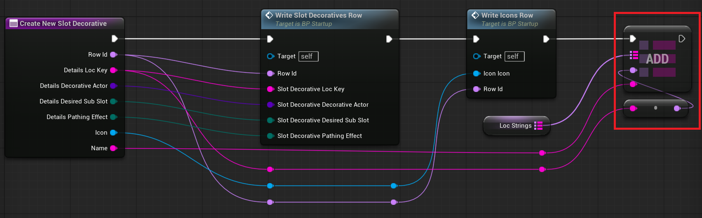

At the very end of the mod code, I take that map I have built and call `Add New Strings` using it.

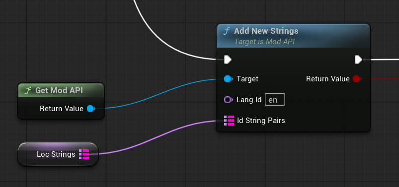

This function on the mod API adds the localization keys and their English values to the English table. That is to say - it doesn't add it to the `Loc_En` data table, it adds it to a runtime expansions map that is used by the localization manager (`LocManager` class). Then it rebuilds all the widgets in the game by taking into account these keys and values that the mod has added. This in turn picks up the keys added to the `SlotDecoratives` table earlier in the mod and goes "hey, I've got this key in the runtime expansions map, let me fetch the value of it instead" and now your mod is ready for localization and is localized in English!

The reason I build the full map first then call `Add New Strings` at the end is because rebuilding all game widgets is a performance intensive task and it should be called as little as possible, otherwise the user will notice stutters!

> [!IMPORTANT]
> You need to make sure that your mod is at the very least adding the strings to the `en` language ID, then the localization mods can add your localization strings to their mods so your native language can be supported there. You can still add translations for your native language in your mod to the `Loc_<your lang id>` table *as well as to `en`*, but note that it may be overriden by a localization mod.

You can look at the `MoreDecoratives` mod code in the project to understand how it works better. Feel free to add logging or tamper with the code to understand how it works!

In-game it looks like this for Simplified Chinese and English after changing the language in the options:

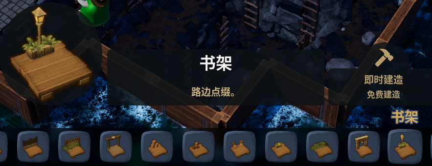
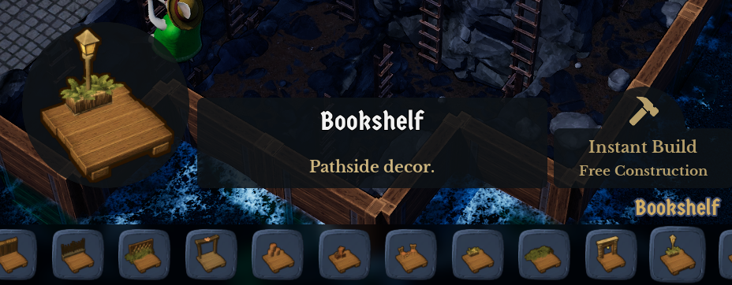

### Registering mod options

This is a little more complicated than with adding stuff to data tables as we also need to get localized strings by key for the currently selected language Id so that we can show the correct mod options language.

The example code for this is in the `ShortNight` mod in the project. 

> [!TIP]
> Code for a more complex mod that adds several new options can be found in `CameraTweaks` mod. If your mod also adds several new options, be sure to check out that code as an example of how to do it for several options in a clean way. However the concepts written here are all the same.

First, you need to make sure you are registering your mod options on `BP_MainMenuLoad`, **not** `BP_Startup`. This is because of a small naunce where we need to do `OnOptionChanged` for the language setting as I will show later. If we have this code in `BP_Startup` only, then if the player opens a save and then exits to main menu, the mod wouldn't be loaded so then when you change the language, it will not use the correct localization. It'll make more sense later.

This is the top level code. 

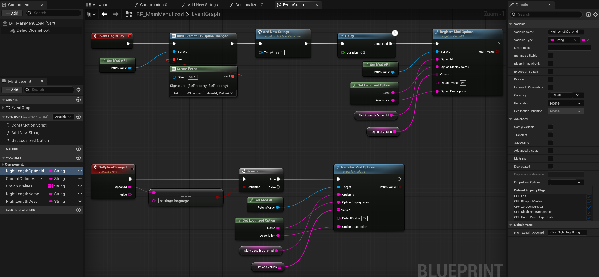

First we bind on `OnOptionChanged` which I will talk about later.

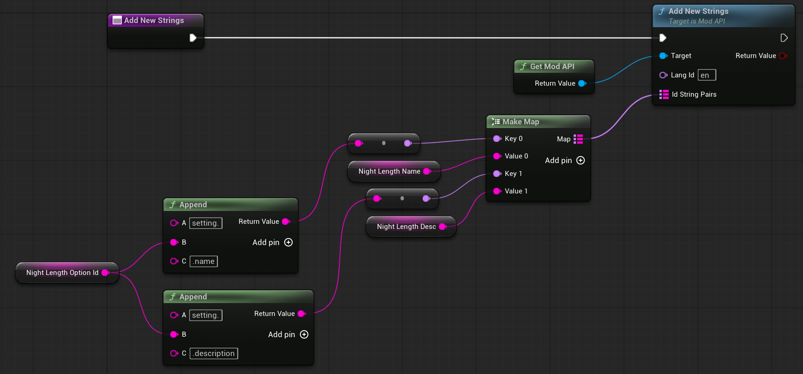

Now, in `Add New Strings`, we add the English localization strings for our mod options. These will also be used as a fallback if there is no localization available for the selected language.

The append nodes are just to construct the localization keys for the mod:

```
setting.ShortNight-NightLength.name
setting.ShortNight-NightLength.description
```

> [!NOTE]
> I recommend doing it this way so that if your mod option Id changes for whatever reason, the localization strings will change along with it. At first glance, this seems like a bad idea because if the option Id changes then the localization key will be void and the localization mods will need to update to match, however you should **never** be changing your mod option Ids unless they are changing fundamentally (or just removing them) because the user choice will be lost/reset to default as well. 

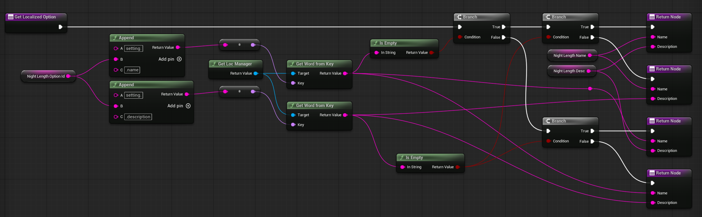

In `Get Localized Option`, we again construct the localization keys for the mod, then use the `Get Word From Key` node on the `LocManager` class. This function internally will use the localization key and the currently selected language and get the string value from that. 

If there is no translation for the provided localization key, it will return an empty string. Therefore, there is some code for checking if name or description keys are empty, and if they are, fall back to the English strings we have in our mod. It looks a bit tricky at first but if you follow the flow it looks like this:

```
if setting.ShortNight-NightLength.name value is empty:
    if setting.ShortNight-NightLength.description value is empty:
        return english name & description
    else
        return english name & localized description
else
    if setting.ShortNight-NightLength.description value is empty:
        return localized name & description
    else
        return localized name & localized description
```

Back in our top level code, why do a small delay?

We need this delay because the game loads mods alphabetically, meaning that it is possible that a localization mod will load *after* your mod. If that happens, we need to make sure that we only read the localization map *after* the code in the localization mod has ran and added it. So a 0.2s delay is enough to allow this to happen. 

So now we have our name and description, localized or fallback, we then call `Register Mod Options` with the right values.

Now, in the case that the player changes the language setting to something else, we need to handle that change and get the new localized name and description and call `Register Mod Options` again. The language setting options Id is `settings.language`. Since we need this event code to fire even after the player enters a save and exits back to main menu, we need this code to run on `BP_MainMenuLoad`. 

In-game it looks like this for Simplified Chinese and English after changing the language in the options (without needing to restart the game):

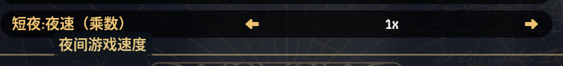
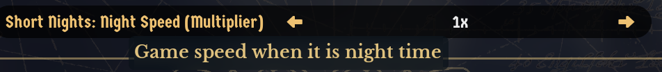

### Adding mod widgets

If you mod adds its own widgets with text on it and you want that text to be localizable, we need to do something similar to the above example with `Register Mod Options`, that we need to call `Get Word From Key` to read the localizations added by the localization mods.

The code for this demo mod can be found in the `WidgetLocalization` mod in the project.

In this demo mod we have a simple widget with just a text box with the localization key in it. 

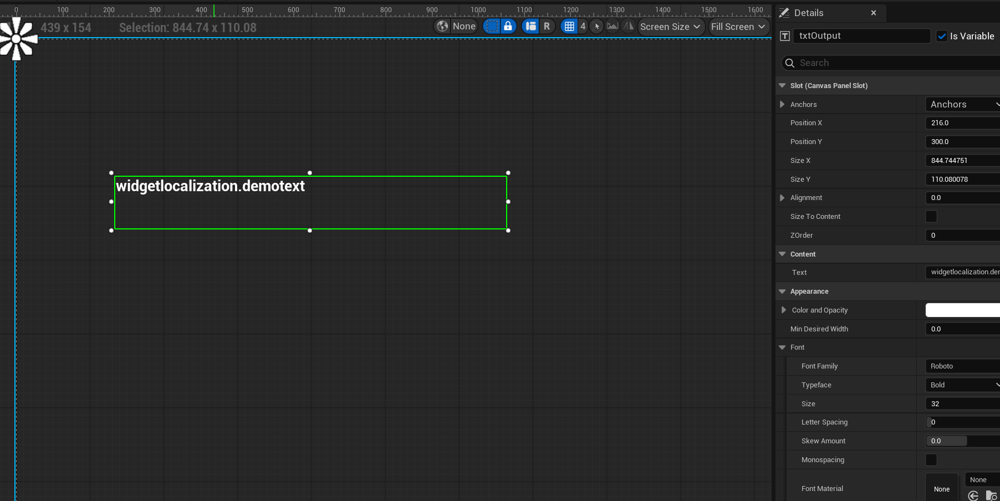

If your widget is in the main menu, this code should go in `BP_MainMenuLoad` (so it runs even if player enters level and goes back to main menu). If it is in the game, the code should go into `BP_MapLoad`.

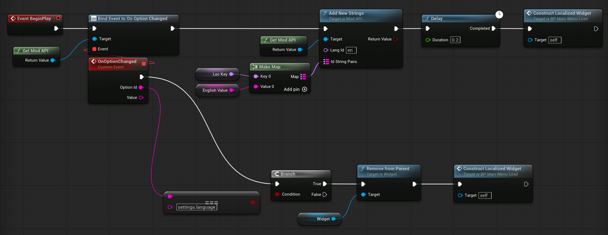

So as before in the above example, we first bind on `OnOptionChanged`, then we add the english text for the localization key.

But then why do a small delay?

We need this delay because the game loads mods alphabetically, meaning that it is possible that a localization mod will load *after* your mod. If that happens, we need to make sure that we only read the localization map *after* the code in the localization mod has ran and added it. So a 0.2s delay is enough to allow this to happen. 

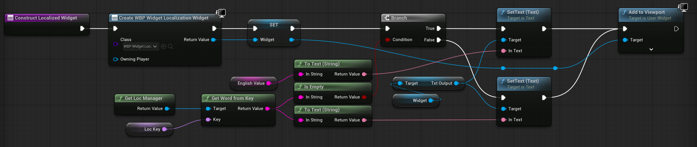

Now we construct the mod widget and call `Get Word From Key` using the localization key variable. If no localization is found for the currently selected language, fallback to the English value. Set the text box's value and add the widget to the viewport.

Back in the top level code, if the player changes the language setting option, we need to reload and reconstruct our mod widget using the new language, if a localization for it exists.

In-game it looks like this for Simplified Chinese and English after changing the language in the options (without needing to restart the game):

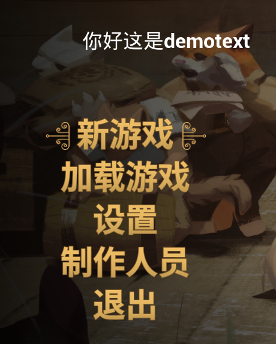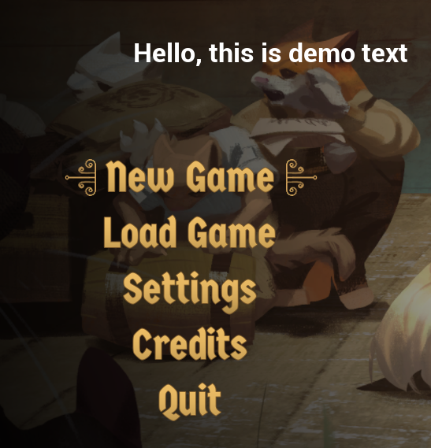